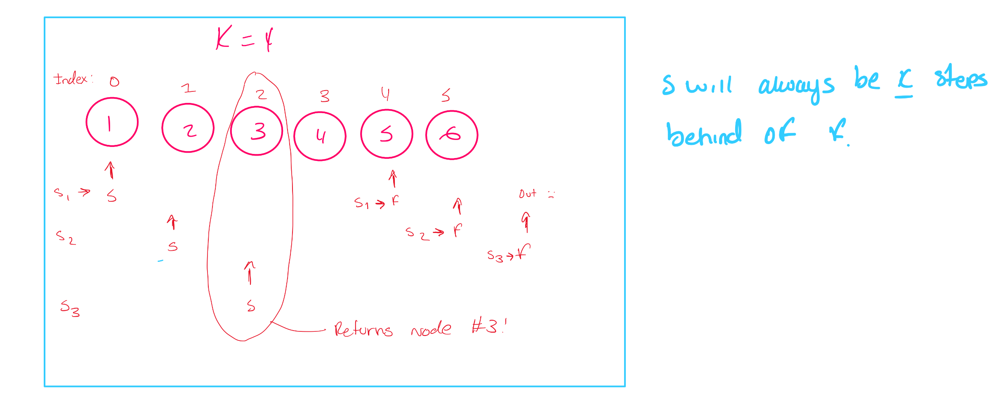

*Node*: A basic data structure which contain data and one or more links to other nodes.

*Linked List* Is similar to an array but each node will have a *next* pointer which points to the node representing the element int the sequence.

EX: 0--\>1--\>2

::: panel-tabset
## Java

``` java
  public static class ListNode{
  int val;
  ListNode next;
  ListNode (int val){
  this.val = val;
  }
  
  public static void main(String[] args){
  
  ListNode one = new ListNode(1);
  ListNode two = new ListNode(2)
  ListNode three = new ListNode(3)
  
  one.next = two;
  two.next = three;
  ListNode head = one;
  
  

}
}
    
```

## Python

``` python
class ListNode:
    def __init__(self,val):
        self.val = val
        self.next = None
one = ListNode(1)
two = ListNode(2)
three = ListNode(3)

one.next = two
two.next = three
head = one

print(head.val)
print(head.next.val)
print(head.next.next.val)
```
:::

ListNode (1) is the head because it is the start of the linked list. **Keep a reference to the head because it is the only node from where you can reach all elements in the list**

+-----------------------------------------------+---------------------------------------------------------------------------------+
| Advantages                                    | Disadvantages                                                                   |
+===============================================+=================================================================================+
| Add & remove elements at any position in O(1) | No random access. (Inefficient way of accessing elements in the array if large) |
|                                               |                                                                                 |
| *need to have reference node*                 |                                                                                 |
+-----------------------------------------------+---------------------------------------------------------------------------------+
| Doesn't have a fixed size                     | Have more overhead than arrays.                                                 |
+-----------------------------------------------+---------------------------------------------------------------------------------+
|                                               | Every element needs to have extra storage for the pointer                       |
+-----------------------------------------------+---------------------------------------------------------------------------------+

-   Assignment(=) When you assign a pointer to an existing linked list node the pointer refers to the object in memory.

::: panel-tabset
## Java

``` java

ListNode ptr = head;
head = head.next;
head = null;
```

``` python
ptr = head
head = head.next
head = None
```
:::

After the code is run prt still refers to the original head node **VARIABLES REMAIN AT NODES UNLESS THEY ARE MODIFIED DIRECTLY**

-   Chaining .next

*iterating through a linked list*

::: panel-tabset
## Java

``` java
    int getSum(ListNode head){
        int ans = 0;

        while (head != null){
            ans += head.val;
            head = head.next;
        }
        return ans;
    }
```

## Recursive Java

``` recursive.java
int getSum(ListNode head){
  if(head ==null){ return 0}
  return head.val + getSum(head)
}
```

## Python

``` python

  def getSum(head):
  ans =0 
  while head: 
    ans += head.val
    head = head.next
  return ans
```

## Recursive Python

``` recursive.py
def getSum(head):
  if not head: return 0
  return head.val + get_sum(head.next)
```
:::

## Types of linked list

### Singly linked list

*most common type*

Each node only has a pointer the the next node. You can *only* move *forward* in the list when iterating.

*reference node*: next

1)  How do we add an element to a linked list so that it becomes the element at position i

::: panel-tabset
## Java

``` java
class ListNode{
  int val;
  ListNode next;
  ListNode (int val){ this.val =val}
}

// prevNode is the node at position i-1
void addNode(ListNode prevNode, ListNode nodeToAdd){
  nodeToAdd.next = prevNode.next;
  prevNode.next = nodeToAdd;
}
```

## Python

``` python
class ListNode:
  def __init__(self,val):
  self.val = val
  self.next = None
  
def add_node (prev_node, note_to_add)
  note_to_add.next = prev_node.next
  prev_node.next = node_to_add
```
:::

2)  How do we delete the element at position i?

::: panel-tabset
## Java

``` java
class ListNode{
  int val;
  ListNode next;
  ListNode (int val){ this.val =val}
}

// prevNode is the node at position i-1
void deleteNode(ListNode prevNode){
  prevNode.next = prevNode.next.next
}
```

## Python

``` python
class ListNode:
  def __init__(self,val):
  self.val = val
  self.next = None
  
def delete_node (prev_node,)
  prev_node.next = prev_node.next.next
```
:::

Big (O)

-   With reference (i-1) O(1)

-   Without reference O(n)

### Doubly linked list

Similar to singly linked list but each node also contains a pointer to the previous node (prev) *allows iteration in both directions*

::: panel-tabset
## Java

``` java
class ListNode{
  int val;
  ListNode next;
  ListNode prev;
  ListNode(int val){
    this.val = val
}

void addNode(ListNode node, ListNode nodeToAdd){
  ListNode prevNode = node.prev;
  nodeToAdd.next = node;
  nodeToAdd.prev = prevNode;
  prevNode.next = nodeToAdd;
  node.prev = nodeToAddl
}

void deleteNode(ListNode node){
  ListNode prevNode = node.prev;
  ListNode nextNode = node.next;
  prevNode.next = nextNode;
  nextNode.prev = prevnode;
}
}
```

## Python

``` python
class ListNode:
  def __init__(self,val):
  self.val = val
  self.next = None
  
def delete_node (prev_node,)
  prev_node.next = prev_node.next.next
```
:::

### Linked list with sentinel nodes

Sentinel nodes sit at the start and end of linked lists and are used to make operations and the code needed to execute those operations cleaner.

Start of linked list *HEAD* End of a linked list *TAIL*

::: panel-tabset
## Java End of List

``` java
class ListNode{
  int val;
  ListNode next;
  ListNode prev;
  ListNode(int val){
    this.val = val
}

void addToEnd(ListNode nodeToAdd){
  nodeToAdd.next = tail;
  nodeToAdd.prev = tail.prev;
  tail.prev.next = nodeToAdd;
  tail.prev = nodeToAdd; 
}

void removeFromEnd(){
  if(head.next == tail){return;}
  ListNode nodeToRemove = tail.prev;
  nodeToRemove.prev.next = tail;
  tail.prev = nodeToRemove.prev
  
}
```

## Java Start of List

``` java
class ListNode{
  int val;
  ListNode next;
  ListNode prev;
  ListNode(int val){
    this.val = val
}

void addToStart(ListNode nodeToAdd){
  nodeToAdd.next = head;
  nodeToAdd.prev = head.next;
  head.next.prev = nodeToAdd;
  head.next = nodeToAdd; 
}

void removeFromStart(){
  if(head.next == tail){return;}
  ListNode nodeToRemove = head.next;
  nodeToRemove.next.prev = head;
  head.next = nodeToRemove.next
  
}
```

## Python

``` pyhton
class ListNode:
    def __init__(self, val):
        self.val = val
        self.next = None
        self.prev = None

def add_to_end(node_to_add):
    node_to_add.next = tail
    node_to_add.prev = tail.prev
    tail.prev.next = node_to_add
    tail.prev = node_to_add

def remove_from_end():
    if head.next == tail:
        return

    node_to_remove = tail.prev
    node_to_remove.prev.next = tail
    tail.prev = node_to_remove.prev

def add_to_start(node_to_add):
    node_to_add.prev = head
    node_to_add.next = head.next
    head.next.prev = node_to_add
    head.next = node_to_add

def remove_from_start():
    if head.next == tail:
        return
    
    node_to_remove = head.next
    node_to_remove.next.prev = head
    head.next = node_to_remove.next

head = ListNode(None)
tail = ListNode(None)
head.next = tail
tail.prev = head
```
:::

## Dummy pointers

::: panel-tabset
## Java

``` java
int getSum(ListNode head){
  int ans =0;
  ListNode dummy = head;
  while(dummy != null){
  ans += dummy.val;
  dummy = dummy.next
}
  //same as before but we still have a pointer at the head
  return ans; 
}
```

#Python

``` python
def get_sum(head):
  ans =0
  dummy = head
  while dummy:
    ans += dummy.val
    dummmy = dummy.next
    
    return ans
  
```
:::

# Fast and Slow Pointers

*implementation of the two pointers technique*

The "fast" pointer moves two nodes per iteration. The "slow" pointer moves one node per iteration.

EX: Given the head of a linked list with odd number of odes head, return the value of the node in the middle -- given a linked list that represented 1--\>2--\>3--\>4--\>5 return 3

Solved using two pointer method. If we have one pointer moving twice as fast as the other, then by the time it reaches the end the slow pointer will be halfway trhough since its moving at half speed.

::: panel-tabset
## Java

``` java
int getMiddle(ListNode head){
  ListNode slow = head;
  ListNode fast = head;
  
  while(fast != null && fast.next != null){
    slow = slow.next;
    fast = fast.next.nextl
}
return slow.val;
}
```

## Python

``` python
def get_middle(head):
  slow = head
  fast = head
  
  while fast and fast.next:
  slow = slow.next
  fast = fast.next.next
  
  return slow.val
  
```
:::

Ex 2: Linked List Cycle Given the head of a linked list, determine fi the linked list has a cycle.

:::panel-tabset 

## Java
``` java
bool hasCycle (ListNode, head){
  ListNode slow = head;
  Listnode fast = head;
  
  while(fast !=null && fast.next != null){
    slow = head.next;
    fast = head.next.next;
    
    if(slow == fast){ return true}
  return false;  
}

}
```

## Python

``` python
def hasCycle(self,head)->bool:
  slow = head
  fast = head
  
  while fast and fast.next:
  slow = slow.next
  fast = fast.next.next
  if slow == fast: -- cycle exist 
    return true
  return false -- doesn't exist
  
```

## Java with hashing

``` java
public boolean hasCycle(ListNode head){
  Set <ListNode> seen = new HashSet<>();
  while(head != null){
  if (seen.contains(head)){return true}
  seen.add(head)
  head=head.next
}

}
```

## Python with hashing
``` python         
def hasCycle(self,head: Optional[ListNode])->bool:
  seen = set()
  while head:
    if head in seen:
      return true
    seen.add(head)
    head = head.next
  return false
```

:::

EX 3: Given the head of a linked list and an integer *k* return the kth node from the end.

Given the linked list that represents 1 -\> 2 -\> 3 -\> 4 -\> 5 and k=2 return the node with value 4 as its 2nd from the end

::: panel-tabset

## Java
``` java
int getNode(ListNode head, int k){
  ListNode slow = head;
  ListNode fast =head; 
  i=0;
  
  while(i!=k):
  ListNode = head.next;
  ListNode = head.next.next; 

}
```
## Python
``` python
def getNode(self, head: Optional[ListNode],k) -> int:
  slow = head
  head = head
  
  for i in range(k):
    fast = fast.next
    
  while fast:
    slow = slow.next
    fast = fast.next
  return fast
  
```
:::

{fig-align="center" width="468"}


# Reversing a Linked List

::: panel-tabset

# Java
``` java
ListNode reverseList(ListNode head){
  ListNode prev = null;
  ListNode curr = head;
  
  while(curr != null){
    ListNode nextNode = curr.next; //storing the next node
    curr.next = prev;
    prev = curr; 
    curr = nextNode
}
  return prev;
}
```
:::

1. When we are at a node curr, we need to set its next pointer to the node we were at previously.
- Use a prev pointer to track the previous node.
2. The prev pointer needs to also update every iteration.
- After updating curr.next, set prev = curr in preparation for the next node.
3. If we set curr.next = prev, then we lose the reference to the original curr.next.
- Use nextNode to keep a reference to the original curr.next.

> EX: Swap Nodes in pairs
Given the head of a linked list swap every pair of nodes. 
Input:  1->2->3->4->5->6 
Output: 2->1->4->3->6->5

::: panel-tabset

#Java

``` java
public ListNode swapPairs(ListNode head) {
  //check for edge cases (0 or 1 list)
  if(head ==null or head.next == null){
  return head.
}

  ListNode dummy = head.next;
  ListNode prev = null;
  while(head != null && head.next != null){
    if(prev != null){
      prev.next = head.next;
  }
    prev = head;
    
    ListNode nextNode = head.next.next;
    head.next.next = head;
    
    head.next = nextNode;
    head = nextNode;
}

return dummy;

}
```
:::

# Example problems

Problem 1: Given the head of a singly linked list, return the middle node of the linked list. If there are two middle nodes, return the second middle node.

> Input: head = [1,2,3,4,5]
Output: [3,4,5]
Explanation: The middle node of the list is node 3.


> Input: head = [1,2,3,4,5,6]
Output: [4,5,6]
Explanation: Since the list has two middle nodes with values 3 and 4, we return the second one.
 

:::panel-tabset
## Java
```java
/**
 * Definition for singly-linked list.
 * public class ListNode {
 *     int val;
 *     ListNode next;
 *     ListNode() {}
 *     ListNode(int val) { this.val = val; }
 *     ListNode(int val, ListNode next) { this.val = val; this.next = next; }
 * }
 */
class Solution {
    public ListNode middleNode(ListNode head) {
        
        ListNode slow = head;
        ListNode fast = head;
        
        while(fast != null && fast.next != null){
            slow = slow.next;
            fast = fast.next.next;
                }
            return slow;
            }
            }
        
```
:::


Problem 2: Remove Duplicates from sorted list

:::panel-tabset

# Java

```java
/**
 * Definition for singly-linked list.
 * public class ListNode {
 *     int val;
 *     ListNode next;
 *     ListNode() {}
 *     ListNode(int val) { this.val = val; }
 *     ListNode(int val, ListNode next) { this.val = val; this.next = next; }
 * }
 */
 
 class Solution {
    public ListNode deleteDuplicates(ListNode head) {
    
      ListNode current = head;
      
      while(current != null && current.next!=null){
      if(current.next.val == current.val){
        current.next = current.next.next;
      }
      else{
      current = current.next;
  }
      return head;
        
    }
}
 
```
:::