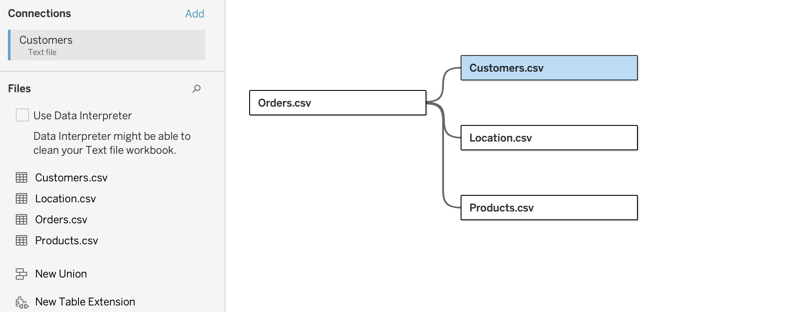
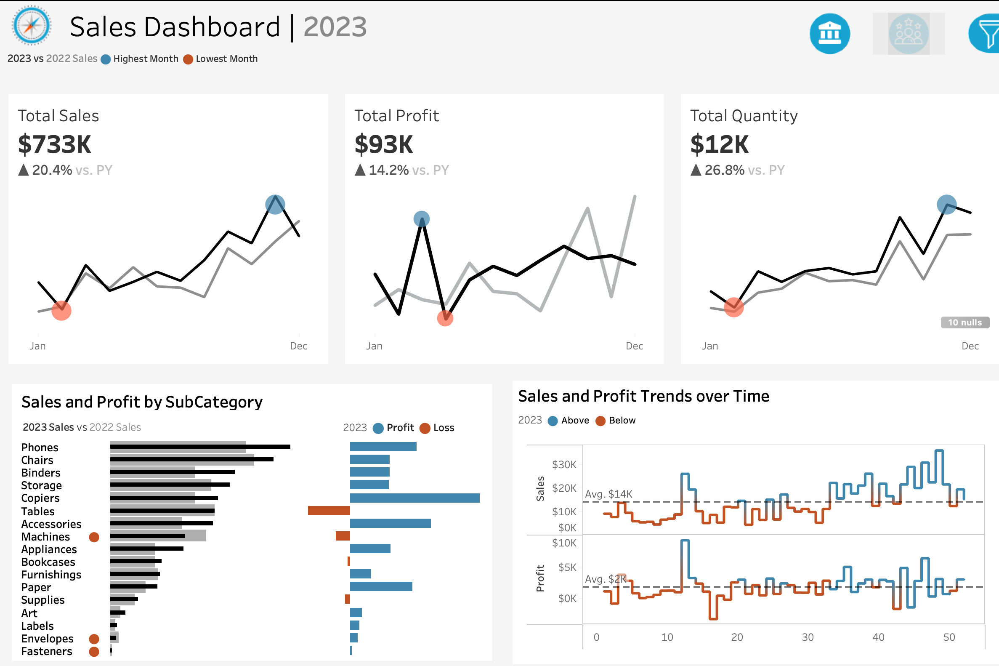

*Build two dashboards using tableau to help stakeholders to analyze sales performace and customers.*

# Steps to create a dashboard

## Analyse Project Requirements

1.  Collect Requirements
2.  Choose Right Charts
3.  Draw Mock-ups
4.  Choose Colors

## Preparing Data Source

1.  Connect Data
2.  Understand Data
3.  Rename Fields & Tables
4.  Check Data Types
5.  Understand Data

## Build Charts

1.  Create Calculated Fields & Test
2.  Build Charts
3.  Format Charts

## Build Dashboard

1.  Draw Mock-up for Container
2.  Create Container Structure
3.  Put charts Together
4.  Format

# Dashboard 1: Sales Dashbaord

*Present an overview of the sales metrics and trends in order to analyze year over year sales performance and understand sales trends*

### Sales Dashboard Main Requirements

1.  KPI Overview:
    -   Have a summary of total sales profits and quantity for the current and previous years
2.  Sales Trends:
    -   Present the data for each KPI on a monthly bases for both the current and previous years
    -   Identify months with highest and lowest sales and make them easy to recognize
3.  Project Subcategory Comparison:
    -   Compare sales performance by different product subcategories for the current and previous years. Include comparison of sales with profit
4.  Weekly trends for sales and profit
    -   Weekly sales and profit data for the current year
    -   Average weekly values
    -   Highlight weeks that are above and below the average to draw attention to sales & profit performance
5.  Dynamic Dashboard
    -   Allow user the option to select any desired year
    -   Make the charts and graphs interactive
    -   Include data filters

### Creating a Data Model

I started with Orders.csv since it is a **fact** *Stores quantitative data* table.

## Sales Dashboard

### Customer Dashboard Requirements

1.  KPI Overview: Display a summary of total number of customers, total sales per customer and total number of orders for the current and previous year

* create a new current year customer calculated field.
* calculate the current year sales per customer: `SUM(CY Sales) / COUNTD(CUSTOMER ID)`
